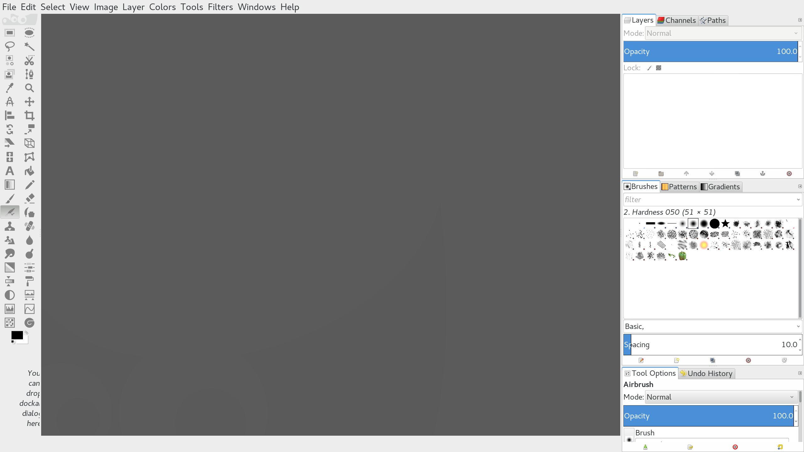

# Gimp HiDPI

A theme to for HiDPI displays (Macbook Pro Retina / X1 Carbon).

I am (at the time of writing) running Gnome 3.18 and Gimp 2.8. Gnome handles
scaling the UI pretty well but Gimp is lacking with the icons.

In summary, I just replaced the icons with flat-style SVGs and changed the
background color. 




## Installation

1.) First, [download the zip file of this
repo](https://github.com/jedireza/gimp-hidpi/archive/master.zip).

2.) Then unzip it into your local Gimp themes folder:

```bash
$ unzip gimp-hidpi-master.zip -d ~/.gimp-2.8/themes/
$ mv ~/.gimp-2.8/themes/gimp-hidpi-master/ ~/.gimp-2.8/themes/gimp-hidpi/
```

3.) Then choose the theme in Gimp via `Edit > Preferences`.


## Inspiration

### sv32

The `imagerc` file was inspired by the sv32 icon theme:

 - http://gnome-look.org/content/show.php/?content=150006

### Toolbar icons

The icons are from the [GNOME Project](http://www.gnome.org). Specifically I
found them here:

 - https://github.com/gnome-design-team/gnome-icons/

### Background color

 - http://doctormo.deviantart.com/art/Gimp-2-8-Photoshop-Tweaks-432736644
 - https://github.com/doctormo/GimpPs


## License

This repo: ISC

The icons: [CC BY-SA 3.0](http://creativecommons.org/licenses/by-sa/3.0/)
